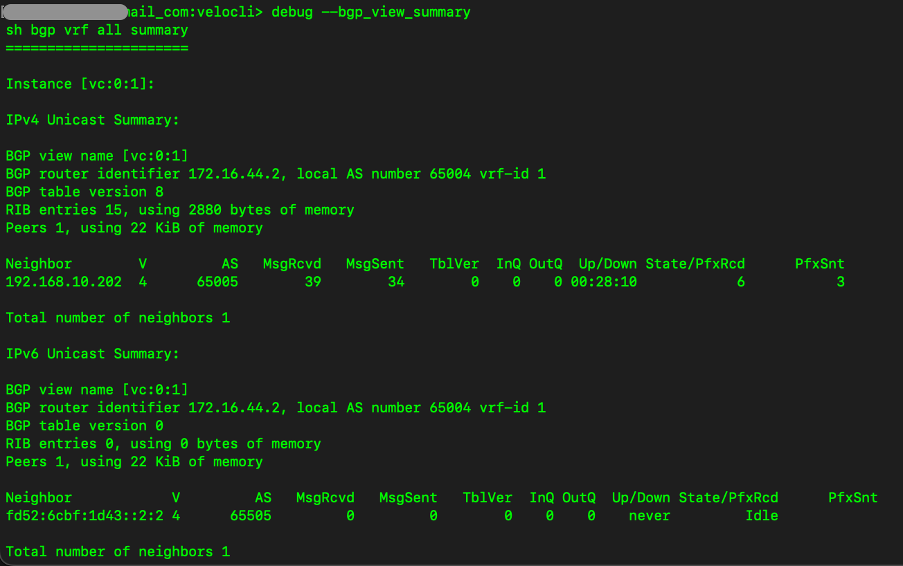

#	--bgp_view_summary [v4 | v6 | all]

##	Description
Summary of BGP configuration and neighbor states

##  Arguments (optional)
| Argument | Description |
|---|---|
| none (or 'all') | Display all BGP neighbors |
| v4 | Display only IPv4 neighbors |
| v6 | Display only IPv6 neighbors |

##  Example usage

##  Field descriptions
| Column | Description |
|---|---|
| Neighbor | BGP neighbor IP address |
| AS | Autonomous system number of the BGP neighbor |
| MsgRcvd | Count of BGP messages received from neighbor |
| MsgSent | Count of BGP messages sent to neighbor |
| Up/Down | Time since last up/down state change |
| State/PfxRcd | BGP neighbor state if not established, otherwise displays qty of prefixes received from neighbor |
| PfxSnt | Quantity of prefixes advertised to BGP neighbor |