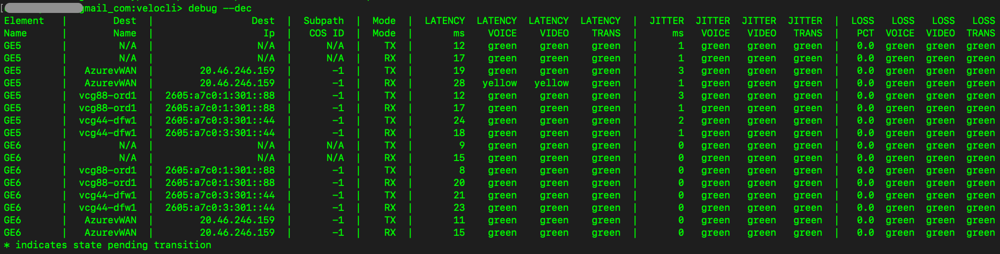

#	--dec

##	Description
Dump the dynamic error correction status and QoE scoring detail of all overlay paths.  Outputs include the latency, jitter, and packet loss values observed in both the tx and rx direction for each overlay path/tunnel established on the edge.  Output also includes a red/yellow/green QoE score value based on the thresholds outlined in [this kb article](https://knowledge.broadcom.com/external/article/330715/vmware-sdwan-edge-link-selection-behavio.html).

##  Arguments
None

##  Example usage

##  Field descriptions
| Column | Description |
|---|---|
| Element Name | WAN interface that path is established on |
| Dest Name | Name of the peer edge/gateway that the associated tunnel is built to |
| Dest IP | IP address of the remote edge/gateway tunnel interface |
| Subpath COS ID | Class Of Service value assigned to the sub-path if configured ('-1' if no sub-paths) |
| Mode | Directionality of path values ('TX' for the transmit direction, 'RX' for receive) |
| Latency | Latency measurement in milliseconds with QoE scores for voice, video, and transactional thresholds |
| Jitter | Jitter measurement in milliseconds with QoE scores for voice, video, and transactional thresholds |
| Loss | Percentage of packet loss with QoE scores for voice, video, and transactional thresholds |