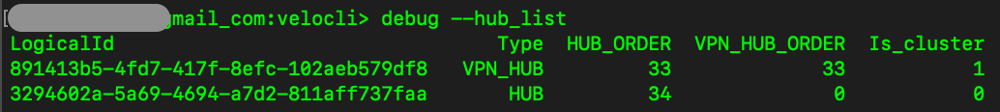

#	--hub_list

##	Description
Dumps a list of conifgured hubs along with basic attributes.

##  Arguments
None

##  Example usage

##  Field descriptions
| Column | Description |
|---|---|
| LogicalId | UUID of the edge or cluster configured as a hub. Friendly name can be retrieved for reference using the ["debug --user_peer_dump"]() command. |
| Type | Values are either "VPN_HUB" (in the case of an edge configured as a b2b VPN hub) or "HUB" (for hubs not configured as b2b VPN hubs) |
| HUB_ORDER | Value indicating the hubs configured position in the profile's list of hubs, which translates to the order flag for any routes learned via that hub (and can act as a tie breaker when multiple routes are learned from multiple hubs with similar attributes as described in the [VeloCloud SD-WAN Routing Overview](https://techdocs.broadcom.com/us/en/vmware-sde/velocloud-sase/vmware-velocloud-sd-wan/6-2/sd-wan-administration-guide/overview-3-admin/vmware-sd-wan-routing-overview-admin.html)). Actual values will vary by software version, but lower values are higher on the list of hubs and more preferred from a routing standpoint |
| VPN_HUB_ORDER | Value indicating the hubs configured position in the profile's list of VPN hubs, influencing which hub will be the preferred path for branch to branch VPN traffic when multiple viable VPN hubs are configured between two branch edges |
| Is_cluster | For VPN_HUB type, indicates whether the hub is a cluster (value of 1 indicates that it is a cluster, 0 is an individual edge or HA pair).  For non-VPN hubs (type of 'HUB') this value will always be 0. |
