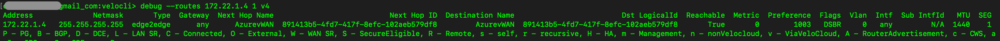

#	--routes [[all|prefix] [all|segment-id] [all|v4|v6]]

##	Description
List of routes known by the edge daemon including destination/reachability details and route type, preference, and flags as detailed in the [VeloCloud SD-WAN Routing Overview](https://techdocs.broadcom.com/us/en/vmware-sde/velocloud-sase/vmware-velocloud-sd-wan/6-2/sd-wan-administration-guide/overview-3-admin/vmware-sd-wan-routing-overview-admin.html)

##  Arguments (optional)
| Argument | Description |
|---|---|
| none (or 'all') | Display all routes |
| prefix | Display routes only for a specific prefix/address (i.e. 10.1.1.1, fe80::7, etc) |
| segment-id | Display routes only in a specific segment number (i.e. global segment is '0', additional segments increment on from '1') |
| 'v4' or 'v6' | Display only IPv4 or IPv6 routes |

##  Example usage

##  Field descriptions
| Column | Description |
|---|---|
| Address | Prefix of the matched route |
| Netmask | Subnet mask of the matched prefix |
| Type | Type of route (i.e. edge2edge, cloud, etc.) |
| Gateway | Next hop IP address for local/non-overlay routes |
| Next Hop Name | Name of the next hop peer edge or gateway for the route |
| Next Hop ID | UUID of the next hop peer edge or gateway |
| Destination Name | Name of the final destination edge or gateway for the route (may differ from next hop in the event of an intermediate hub edge/gateway, etc.)|
| Reachable | True/False value indicating whether the destination prefix is currently reachable |
| Preference | Route preference value based on route type as defined in the [VeloCloud SD-WAN Routing Overview](https://techdocs.broadcom.com/us/en/vmware-sde/velocloud-sase/vmware-velocloud-sd-wan/6-2/sd-wan-administration-guide/overview-3-admin/vmware-sd-wan-routing-overview-admin.html) |
| Flags | Flag values to indicate route type and other attributes.  Flag definitions are included at the bottom of the output |
| Vlan | VLAN ID of the destination interface for the route ('0' for overlay and routes via untagged interfaces) |
| Intf | Destination interface for the route ('any' for overlay routes) |
| Sub IntfId | Destination sub-interface for the route ('N/A' for overlay routes or routes via a parent interface) |
| MTU | Path MTU calculated for the destination peer ('N/A' for non-overlay routes) |
| SEG | Numerical segment ID for the segment/vrf in which the route exists | 