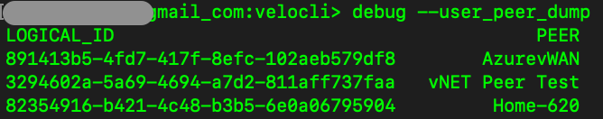

#	--user_peer_dump

##	Description
Dumps a list of all peer edges/clusters with both the peer UUID and friendly name.

##  Arguments
None

##  Example usage

##  Field descriptions
| Column | Description |
|---|---|
| LOGICAL_ID | UUID of the peer edge or cluster |
| PEER | Friendly name of the peer edge or cluster |
